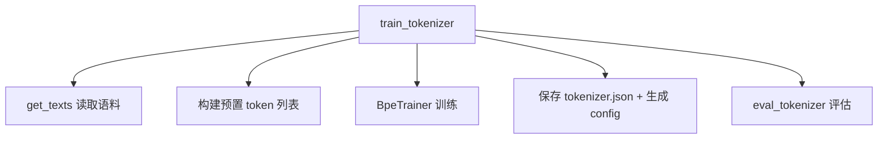

# train_tokenizer.py 介绍

对应源码：[`train_tokenizer.py`](./train_tokenizer.py)

## 一、文件定位

`train_tokenizer.py` 是 MiniMind 项目中用于**训练 BPE 分词器（Tokenizer，即"词典"）**的脚本。

> ⚠️ **重要提示**（来自脚本头部注释）：
> 不建议重复训练 tokenizer。MiniMind 已自带训练好的 tokenizer，基于不同词典训练的模型会导致输出完全不统一，降低社区模型复用性。**本脚本仅供学习和参考**。

## 二、Tokenizer 是什么？

分词器（Tokenizer）是连接「原始文本」与「模型」的桥梁：

```
原始文本 ──分词器(编码)──▶ token id 序列 ──▶ 模型输入
模型输出(token id) ──分词器(解码)──▶ 原始文本
```

模型本身不认识文字，只认识数字。分词器负责把文本切成一个个 token（词元），并为每个 token 分配一个唯一的整数 id。

## 三、关键配置常量

| 常量 | 值 | 说明 |
|------|-----|------|
| `DATA_PATH` | `../dataset/sft_t2t_mini.jsonl` | 训练语料来源 |
| `TOKENIZER_DIR` | `../model_learn_tokenizer/` | 分词器保存目录 |
| `VOCAB_SIZE` | `6400` | 目标词表总大小，包含预置 token 和 ByteLevel 初始 alphabet |
| `SPECIAL_TOKENS_NUM` | `36` | 训练时预置的 added token 总数量；最终并非全部保持 `special=True` |

## 四、脚本整体结构



### 主要函数

| 函数 | 作用 |
|------|------|
| `get_texts(data_path)` | 检查 jsonl 的前 10000 行，从有效对话中生成纯文本迭代器 |
| `train_tokenizer(...)` | 核心：训练 BPE 分词器并保存 |
| `eval_tokenizer(...)` | 评估：验证编码/解码一致性、计算压缩率 |

## 五、训练流程详解

### 1. 读取语料 `get_texts`

- 逐行读取 `sft_t2t_mini.jsonl`
- 提取每条数据的 `conversations` 字段中所有 `content`
- 用 `\n` 拼接成一段文本
- 最多取前 10000 行（用于测试）

### 2. 构建预置 token

脚本训练时预置的 added token 分为三类：

1. **对话控制 token**：`<|im_start|>`、`<|im_end|>`、`<|endoftext|>`
2. **多模态边界与占位 token**：`<|vision_start|>`、`<|image_pad|>`、`<|audio_pad|>`、`<|video_pad|>` 等
3. **工具调用 / 思考协议 token**：`<tool_call>`、`</tool_call>`、`<tool_response>`、`</tool_response>`、`<think>`、`</think>`

此外还会**预留 buffer token**（`<|buffer1|>` 等），将预置 token 总数补齐到 `SPECIAL_TOKENS_NUM=36`。这 36 个 token 训练时都会传给 `BpeTrainer`，但脚本保存后会把协议 token 和 buffer token 改成 `special=False`；最终只有 `special_tokens_list` 中的 21 个 token 保持 `special=True`。

### 3. BPE 训练核心

```python
tokenizer = Tokenizer(models.BPE())
tokenizer.pre_tokenizer = pre_tokenizers.ByteLevel(add_prefix_space=False)
```

- **BPE（Byte Pair Encoding）**：从 ByteLevel 产生的初始符号出发，反复合并语料中高频的相邻符号对，逐步构造新 token，直到达到目标词表大小或没有可继续合并的符号对。
- **ByteLevel**：基于字节级别，能处理任意 Unicode 字符（中文、emoji 等都不会产生 `<unk>`）。

```python
trainer = trainers.BpeTrainer(
    vocab_size=vocab_size,
    show_progress=True,
    initial_alphabet=pre_tokenizers.ByteLevel.alphabet(),
    special_tokens=all_special_tokens
)
```

### 4. 保存与配置生成

脚本会生成四个文件：

1. **`tokenizer.json`** — tokenizer 的核心文件（词表 + 合并规则）
2. **`vocab.json`** — BPE 词表
3. **`merges.txt`** — BPE 合并规则
4. **`tokenizer_config.json`** — 配置信息，包含：
   - `bos_token` / `eos_token` / `pad_token` / `unk_token` 的映射
   - `chat_template`（聊天模板，Jinja2 语法，控制多轮对话、工具调用、思考内容的格式化）
   - `model_max_length: 131072`（Tokenizer 的输入长度元数据）
   - 多模态相关 token 配置

## 六、评估函数 `eval_tokenizer` 做什么？

| 测试项 | 说明 |
|--------|------|
| **编码/解码一致性** | `decode(encode(text)) == text` 是否成立 |
| **压缩率测试** | 统计中英文文本的「字符数 / token 数」，衡量分词效率 |
| **流式解码测试** | 模拟流式生成场景，逐个 token 解码，验证字节缓冲处理（处理 `\ufffd` 未完成字节） |

### 为什么流式解码需要缓存 token？

每个合法的 token id 都能在词表中找到对应项，但不保证它单独就能解码成合法、可显示的 Unicode 文本。这里使用的是 ByteLevel BPE，BPE 的合并边界可能落在一个 UTF-8 字符的字节序列中间，因此单个 token 有时只包含字符的一部分字节。

例如，汉字“你”的 UTF-8 编码是 `E4 BD A0`。假设它被拆成包含 `E4 BD` 和 `A0` 的两个 token（仅作原理示意），分别解码时都会得到替换字符 `�`（`\ufffd`），合在一起才能解码成“你”：
```text
Token A     -> �
Token B     -> �
Token A + B -> 你
```

因此，流式测试会先将每个 `tid` 加入 `token_cache`，再尝试解码整个缓存：结果为空或仍包含 `\ufffd` 时继续等待后续 token；能够完整解码时，才一起打印 token id、`convert_ids_to_tokens` 返回的原始 token 和解码文本，然后清空缓存。普通文本 token 若能独立解码，就会立即打印。

换句话说，**token 可被分词器识别，不等于该 token 能独立还原成完整文本**；完整 token 序列仍然可以正常解码。这里通过检查 `\ufffd` 判断字节是否完整，适合作为演示性测试；如果原文本本身包含 `�`，它也会被当成“尚未解码完成”。

### 压缩率指标

压缩率 = 字符数 ÷ token 数。在同一统计口径和相近文本上，值越大通常表示每个 token 覆盖的字符更多。具体结果取决于训练语料、词表和测试文本，中英文不能套用固定范围，应以脚本实际输出为准；该指标也不能单独代表 tokenizer 或下游模型的整体质量。

## 七、运行方式

```python
if __name__ == '__main__':
    train_tokenizer(DATA_PATH, TOKENIZER_DIR, VOCAB_SIZE)
    eval_tokenizer(TOKENIZER_DIR)
```

满足以下前置条件后，运行脚本即可完成「训练 → 保存 → 评估」全流程：

1. 已安装 `requirements.txt` 中的依赖。
2. 已按项目 [`README.md`](../README.md) 的数据下载说明，将 `sft_t2t_mini.jsonl` 放入仓库的 `dataset/` 目录。该数据文件不随 Git 仓库提供。

脚本中的默认数据与输出路径以 `trainer/` 为当前目录，因此应从该目录运行：

```bash
cd trainer
python train_tokenizer.py
```

## 八、关键设计点总结

1. **ByteLevel BPE** 保证任意字符可编码，无 OOV（out-of-vocabulary）问题。
2. **预置 added token** 为多模态、工具调用、思考（R1 风格）协议预留了单 token 表示。
3. **buffer token 预留机制** 为未来按原 id 替换 token 留出位置；只有保持既有 token-id 映射不变时才有助于兼容，重新训练 tokenizer 仍会破坏已有权重兼容性。
4. **chat_template 内嵌** 到 config 中，让训练好的 tokenizer 可直接配合 `apply_chat_template` 使用。

## 九、项目脉络：Tokenizer 为什么位于所有阶段之前？

Tokenizer 决定“文本如何映射到模型参数中的行号”：

```text
文本
  └─> Tokenizer: token -> id
        └─> Embedding[id]
              └─> Transformer
                    └─> lm_head[id]
                          └─> Tokenizer: id -> 文本
```

Embedding 的第 100 行与输出头的第 100 类代表哪个 token，完全由词表定义。模型权重一旦训练，这个 id 映射就固定了。即使新 Tokenizer 仍有 6400 个 token，只要排列不同，同一行参数就对应了不同文本，原权重的语义会整体错位。

因此项目主线是：

```text
固定 Tokenizer
  ├─> PretrainDataset
  ├─> SFT / DPO 数据模板
  ├─> PPO / GRPO / Agent rollout
  ├─> 命令行与 API 推理
  └─> 模型格式转换
```

这解释了脚本为什么明确标注“仅供学习”，也解释了重新训练词表会破坏社区权重兼容性。

## 十、特殊 Token 的实现细节

最终生成文件中，`special=True` 的 token 用于表达序列结构或控制语义，而不是普通自然语言内容。例如：

- `<|im_start|>` / `<|im_end|>`：标记一条聊天消息的开始和结束。
- `<|endoftext|>`：名称沿用 end-of-text 语义，但本脚本没有把它配置为 EOS，而是将它同时配置为 padding 和未知 token；实际 `eos_token` 是 `<|im_end|>`。
- `<|image_pad|>` / `<|audio_pad|>`：在文本序列中充当多模态内容的占位符。

训练器最初把 `all_special_tokens` 交给 `BpeTrainer`，目的有两个：

1. 这些字符串在本次训练生成的词表中优先占据按列表顺序分配的 token id。
2. BPE 不会把它们拆成普通字节片段。

### 为什么特殊 Token 设置了两次？

训练器和 Tokenizer 上的两个参数处在不同阶段，职责也不同：

| 代码 | 阶段 | 作用 |
|------|------|------|
| `BpeTrainer(special_tokens=all_special_tokens)` | 训练词表时 | 将全部控制、协议和 buffer token 纳入目标词表，提前确定 id，并保证它们不会被 BPE 拆分 |
| `tokenizer.add_special_tokens(special_tokens_list)` | 训练完成后 | 向 Tokenizer 再次登记核心控制 token 的特殊语义，使其可被 `skip_special_tokens=True` 等运行时行为识别 |

两次传入的列表并不相同：`all_special_tokens` 包含核心控制 token、`<think>` / `<tool_call>` 等协议 token 以及 buffer token；`special_tokens_list` 只包含 `<|im_start|>`、`<|im_end|>` 等核心控制 token。作者的意图是让前者全部保持为不可拆分的单 token，但只让后者在解码时作为真正的特殊标记被隐藏。

由于这些 token 经过 `BpeTrainer` 后已经存在于词表，`add_special_tokens` 通常不会再创建新 token 或分配新 id，这一步主要是显式确认核心 token 的运行时属性，存在一定的防御性冗余。它也不会自动把其他 token 改成 `special=False`，所以代码随后仍需直接修改 `tokenizer.json`，才能真正区分核心控制 token 与协议、buffer token。中间的 `tokenizer.decoder = decoders.ByteLevel()` 与特殊 token 注册无关，只负责把字节级 token 还原成文本。

`skip_special_tokens` 是解码参数，只控制 token id 转回文本时是否隐藏 `special=True` 的 token。例如，模型输出对应：

```text
<|im_start|>assistant
你好！<|im_end|>
```

使用 `tokenizer.decode(ids, skip_special_tokens=True)` 时，消息边界标记不会出现在解码文本中；设为 `False` 时则会保留它们。这个参数不会修改模型输出的 token id，也不决定编码时是否自动插入特殊 Token。本脚本没有配置 post-processor，且 `add_bos_token` / `add_eos_token` 都是 `False`，因此普通编码不会自动插入这些边界；对话边界由 `chat_template` 显式生成。

训练完成后，代码又编辑 `tokenizer.json`：不属于 `special_tokens_list` 的 added token 会被标记为 `special=False`。因此工具和 thinking 标签虽然保持单 token，却不会被 `skip_special_tokens=True` 自动删除。

这个区别很重要：

- `<|im_start|>`、`<|im_end|>` 等控制符通常不应显示给用户，适合作为真正 special token。
- `<tool_call>`、`<think>` 等标签需要在训练、解析或流式展示阶段保留，若解码时直接跳过，协议结构就会丢失。

Buffer token 预占了词表位置。只有未来在保持 id 不变的前提下原地替换这些占位 token，才可能避免其他既有 id 移动；当前脚本没有提供自动替换机制，也不能保证重新训练后的 tokenizer 与已有权重兼容。

## 十一、Chat Template 的执行脉络

生成的 `tokenizer_config.json` 内嵌 Jinja 模板，负责把结构化 messages 变成训练文本。主要分支包括：

- 有 tools：构造 system 工具说明和 `<tools>` JSON 列表。
- system/user 消息：加入 `<|im_start|>role` 与 `<|im_end|>`。
- assistant 消息：组合 `reasoning_content`、`<think>` 和正文。
- assistant tool_calls：输出 `<tool_call>` 包裹的 JSON。
- tool 消息：连续工具结果组合为 `<tool_response>` 区域。
- `add_generation_prompt=True`：在末尾添加 assistant 起始标记。
- `open_thinking=True`：只打开 `<think>`；否则插入一个空 thinking 块后进入答案。

SFT、DPO、RLAIF 等对话类数据处理以及 Agent、聊天推理会调用 `apply_chat_template`，但 `PretrainDataset` 不使用聊天模板。模板是对话文本格式的主要生成来源，而不是整个协议唯一的事实来源：SFT label 识别和 Tool Call 解析仍依赖各自的协议逻辑。修改模板后必须同步验证这些调用方。

## 十二、输出文件与兼容性

脚本会在 `TOKENIZER_DIR` 下生成或更新：

- `tokenizer.json`：完整 Fast Tokenizer 描述。
- `vocab.json` / `merges.txt`：单独保存的 BPE 词表和 merge 规则。
- `tokenizer_config.json`：特殊 token、最大长度、多模态字段和聊天模板。

`model_max_length=131072` 是 Tokenizer 的输入长度元数据，可在启用截断等行为时作为默认上限；它不会无条件截断所有输入，也不代表 MiniMind 已训练到该上下文长度，更不代表模型 RoPE、显存和数据都支持同样长度。

## 十三、数据与评估边界

- `get_texts` 只读取前 10000 行，当前脚本定位是教学实验，不是大规模生产词表训练流水线。
- JSON 解析失败的行会静默跳过，正式训练前应单独检查语料质量。
- 压缩率只衡量字符/token 比，不直接代表下游模型质量。
- 编解码一致性测试非常重要，但通过它仍不能证明聊天模板、特殊 token id 和已有权重兼容。
- 流式解码中的 `\ufffd` 表示 UTF-8 字节序列尚不完整；代码缓存 token，直到能够无损解码再显示。
