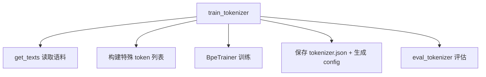

# train_tokenizer.py 介绍

对应源码：[`train_tokenizer.py`](./train_tokenizer.py)

## 一、文件定位

`train_tokenizer.py` 是 MiniMind 项目中用于**训练 BPE 分词器（Tokenizer，即"词典"）**的脚本。

> ⚠️ **重要提示**（来自脚本头部注释）：
> 不建议重复训练 tokenizer。MiniMind 已自带训练好的 tokenizer，基于不同词典训练的模型会导致输出完全不统一，降低社区模型复用性。**本脚本仅供学习和参考**。

## 二、Tokenizer 是什么？

分词器（Tokenizer）是连接「原始文本」与「模型」的桥梁：

```
原始文本 ──分词器(编码)──▶ token id 序列 ──▶ 模型输入
模型输出(token id) ──分词器(解码)──▶ 原始文本
```

模型本身不认识文字，只认识数字。分词器负责把文本切成一个个 token（词元），并为每个 token 分配一个唯一的整数 id。

## 三、关键配置常量

| 常量 | 值 | 说明 |
|------|-----|------|
| `DATA_PATH` | `../dataset/sft_t2t_mini.jsonl` | 训练语料来源 |
| `TOKENIZER_DIR` | `../model_learn_tokenizer/` | 分词器保存目录 |
| `VOCAB_SIZE` | `6400` | 词表大小（BPE 合并次数上限） |
| `SPECIAL_TOKENS_NUM` | `36` | 特殊 token 总数量 |

## 四、脚本整体结构



### 主要函数

| 函数 | 作用 |
|------|------|
| `get_texts(data_path)` | 从 jsonl 读取对话内容，生成纯文本迭代器（最多 10000 行） |
| `train_tokenizer(...)` | 核心：训练 BPE 分词器并保存 |
| `eval_tokenizer(...)` | 评估：验证编码/解码一致性、计算压缩率 |

## 五、训练流程详解

### 1. 读取语料 `get_texts`

- 逐行读取 `sft_t2t_mini.jsonl`
- 提取每条数据的 `conversations` 字段中所有 `content`
- 用 `\n` 拼接成一段文本
- 最多取前 10000 行（用于测试）

### 2. 构建特殊 token

特殊 token 分为三类：

1. **对话控制 token**：`<|im_start|>`、`<|im_end|>`、`<|endoftext|>`
2. **多模态占位 token**：`<|vision_start|>`、`<|image_pad|>`、`<|audio_pad|>`、`<|video_pad|>` 等
3. **工具调用 / 思考 token**：`<tool_call>`、`</tool_call>`、`<tool_response>`、`<think>`、`</think>`

此外还会**预留 buffer token**（`<|buffer1|>` 等），补齐到 `SPECIAL_TOKENS_NUM` 的数量，为后续扩展留位置。

### 3. BPE 训练核心

```python
tokenizer = Tokenizer(models.BPE())
tokenizer.pre_tokenizer = pre_tokenizers.ByteLevel(add_prefix_space=False)
```

- **BPE（Byte Pair Encoding）**：统计文本中相邻字节对的出现频率，反复合并最高频的组合，直到达到 `vocab_size`。
- **ByteLevel**：基于字节级别，能处理任意 Unicode 字符（中文、emoji 等都不会产生 `<unk>`）。

```python
trainer = trainers.BpeTrainer(
    vocab_size=vocab_size,
    show_progress=True,
    initial_alphabet=pre_tokenizers.ByteLevel.alphabet(),
    special_tokens=all_special_tokens
)
```

### 4. 保存与配置生成

保存两样东西：

1. **`tokenizer.json`** — tokenizer 的核心文件（词表 + 合并规则）
2. **`tokenizer_config.json`** — 配置信息，包含：
   - `bos_token` / `eos_token` / `pad_token` / `unk_token` 的映射
   - `chat_template`（聊天模板，Jinja2 语法，控制多轮对话、工具调用、思考内容的格式化）
   - `model_max_length: 131072`（最大长度）
   - 多模态相关 token 配置

## 六、评估函数 `eval_tokenizer` 做什么？

| 测试项 | 说明 |
|--------|------|
| **编码/解码一致性** | `decode(encode(text)) == text` 是否成立 |
| **压缩率测试** | 统计中英文文本的「字符数 / token 数」，衡量分词效率 |
| **流式解码测试** | 模拟流式生成场景，逐个 token 解码，验证字节缓冲处理（处理 `\ufffd` 未完成字节） |

### 压缩率指标

压缩率 = 字符数 ÷ token 数，值越大说明每个 token 承载的信息越多，分词越高效。通常：
- 中文：约 1~1.5（一个 token 约对应 1 个汉字）
- 英文：约 3~4（一个 token 约对应 3~4 个字符）

## 七、运行方式

```python
if __name__ == '__main__':
    train_tokenizer(DATA_PATH, TOKENIZER_DIR, VOCAB_SIZE)
    eval_tokenizer(TOKENIZER_DIR)
```

直接运行脚本即可完成「训练 → 保存 → 评估」全流程：

脚本中的默认数据与输出路径以 `trainer/` 为当前目录，因此应从该目录运行：

```bash
cd trainer
python train_tokenizer.py
```

## 八、关键设计点总结

1. **ByteLevel BPE** 保证任意字符可编码，无 OOV（out-of-vocabulary）问题。
2. **预置特殊 token** 为多模态、工具调用、思考（R1 风格）预留了位置。
3. **buffer token 预留机制** 为未来扩展词典留出空间，保证词典结构稳定。
4. **chat_template 内嵌** 到 config 中，让训练好的 tokenizer 可直接配合 `apply_chat_template` 使用。

## 九、项目脉络：Tokenizer 为什么位于所有阶段之前？

Tokenizer 决定“文本如何映射到模型参数中的行号”：

```text
文本
  └─> Tokenizer: token -> id
        └─> Embedding[id]
              └─> Transformer
                    └─> lm_head[id]
                          └─> Tokenizer: id -> 文本
```

Embedding 的第 100 行与输出头的第 100 类代表哪个 token，完全由词表定义。模型权重一旦训练，这个 id 映射就固定了。即使新 Tokenizer 仍有 6400 个 token，只要排列不同，同一行参数就对应了不同文本，原权重的语义会整体错位。

因此项目主线是：

```text
固定 Tokenizer
  ├─> PretrainDataset
  ├─> SFT / DPO 数据模板
  ├─> PPO / GRPO / Agent rollout
  ├─> 命令行与 API 推理
  └─> 模型格式转换
```

这解释了脚本为什么明确标注“仅供学习”，也解释了重新训练词表会破坏社区权重兼容性。

## 十、特殊 Token 的实现细节

训练器最初把 `all_special_tokens` 交给 `BpeTrainer`，目的有两个：

1. 这些字符串从训练开始就占据固定 token id。
2. BPE 不会把它们拆成普通字节片段。

训练完成后，代码又编辑 `tokenizer.json`：不属于 `special_tokens_list` 的 added token 会被标记为 `special=False`。因此工具和 thinking 标签虽然保持单 token，却不会都被 `skip_special_tokens=True` 自动删除。

这个区别很重要：

- `<|im_start|>`、`<|im_end|>` 等控制符通常不应显示给用户，适合作为真正 special token。
- `<tool_call>`、`<think>` 等标签需要在训练、解析或流式展示阶段保留，若解码时直接跳过，协议结构就会丢失。

Buffer token 则预占词表位置，为未来替换或扩展保留 id 空间，减少已有 id 整体移动的风险。

## 十一、Chat Template 的执行脉络

生成的 `tokenizer_config.json` 内嵌 Jinja 模板，负责把结构化 messages 变成训练文本。主要分支包括：

- 有 tools：构造 system 工具说明和 `<tools>` JSON 列表。
- system/user 消息：加入 `<|im_start|>role` 与 `<|im_end|>`。
- assistant 消息：组合 `reasoning_content`、`<think>` 和正文。
- assistant tool_calls：输出 `<tool_call>` 包裹的 JSON。
- tool 消息：连续工具结果组合为 `<tool_response>` 区域。
- `add_generation_prompt=True`：在末尾添加 assistant 起始标记。
- `open_thinking=True`：只打开 `<think>`；否则插入一个空 thinking 块后进入答案。

数据集、训练和推理都调用 `apply_chat_template`，所以模板是协议的单一事实来源。修改模板后必须同步验证 SFT label 识别、Tool Call 解析和推理输入。

## 十二、输出文件与兼容性

脚本会在 `TOKENIZER_DIR` 下生成或更新：

- `tokenizer.json`：完整 Fast Tokenizer 描述。
- BPE 模型文件：词表和 merge 规则。
- `tokenizer_config.json`：特殊 token、最大长度、多模态字段和聊天模板。

`model_max_length=131072` 是 Tokenizer 接口允许的上限声明，不代表 MiniMind 已训练到该上下文长度，也不代表模型 RoPE、显存和数据都支持同样长度。

## 十三、数据与评估边界

- `get_texts` 只读取前 10000 行，当前脚本定位是教学实验，不是大规模生产词表训练流水线。
- JSON 解析失败的行会静默跳过，正式训练前应单独检查语料质量。
- 压缩率只衡量字符/token 比，不直接代表下游模型质量。
- 编解码一致性测试非常重要，但通过它仍不能证明聊天模板、特殊 token id 和已有权重兼容。
- 流式解码中的 `\ufffd` 表示 UTF-8 字节序列尚不完整；代码缓存 token，直到能够无损解码再显示。
